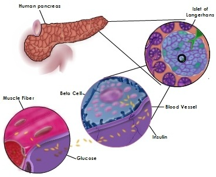
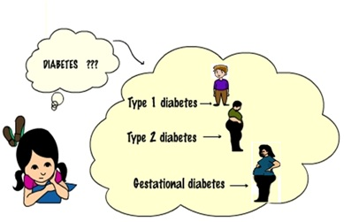
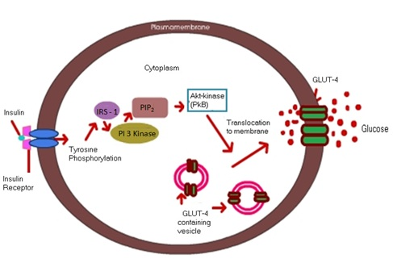

### Principle
 
Glucose uptake activity was analyzed by measuring the rate of uptake of radioactively tagged 2-deoxy-D-glucose in differentiated 3T3-L1 cells. After a period of starvation, the cells were treated with insulin and various plant extracts. These ligands bind to receptors on the cell surface, triggering the translocation of glucose transporters (GLUT4) to the membrane. The cells were then incubated with a radioactive cocktail containing 10 µM 2-deoxy-D-glucose and 0.25 µCi of 2-deoxy-D-[³H]-glucose. The tagged glucose enters the cells via the glucose transporters, mimicking normal glucose uptake. The rate of uptake was measured using a liquid scintillation counter, allowing assessment of both the glucose uptake activity and the effects of plant extracts on this process.

&nbsp;

### Diabetes mellitus

Diabetes mellitus, commonly referred to as diabetes, is a metabolic disorder characterized by elevated levels of glucose in the blood. The word "diabetes" is derived from the Greek word meaning “a siphon”, which refers to something that passes through, indicative of excessive urination—a key symptom of the condition. Diabetes affects people of all ages and backgrounds worldwide and primarily involves dysfunction in the pancreas, a small gland located just behind the stomach.

The pancreas serves both exocrine and endocrine functions and is about five inches long. Scattered throughout the pancreas are clusters of endocrine cells known as the Islets of Langerhans, which contain four main types of hormone-secreting cells: alpha (α), beta (β), delta (δ), and PP cells.

. Alpha cells produce glucagon, a hormone that increases blood glucose levels.

. Beta cells secrete insulin, which facilitates the absorption of glucose from the blood into cells.

. Delta cells produce somatostatin, which regulates the activity of alpha and beta cells.

. PP cells release pancreatic polypeptides, which help modulate pancreatic secretions.

&nbsp;

In a healthy individual, the pancreas releases insulin in a regulated manner. When blood glucose levels rise, beta cells respond by producing insulin. This insulin enters the bloodstream and travels to muscle, fat, and liver cells, which have insulin receptors on their surfaces. When insulin binds to these receptors, it acts like a key, triggering the translocation of glucose transporter channels to the cell surface, allowing glucose to enter the cells. This process helps lower blood glucose levels.

If this system fails, glucose remains in the bloodstream, leading to diabetes. Over time, uncontrolled diabetes can result in serious complications, including heart attacks, strokes, blindness, kidney failure, and nerve damage.

&nbsp;

Diabetes mellitus is of different types. They are 

1. type 1 diabetes mellitus 

2. type 2 diabetes mellitus 

3. gestational diabetes.

&nbsp;

&nbsp;

#### Type 1 diabetes/ Insulin dependent diabetes:
 
Type 1 diabetes is not so common. Only 5-15% of diabetes is type 1. In a person with type 1 diabetes, the pancreas will produce little or no insulin. This is other ways called juvenile diabetes, because it mainly affects childrens and young adults. This type of diabetes is considered as an auto immune disease. In the patient with this disease the pancreatic beta cells are destroyed by their own immune cells. The exact reason for this type of diabetes is still unknown. So there is no production of insulin.

&nbsp;

#### Type 2 diabetes/ Non insulin dependent diabetes:
 
The most prevalent form of diabetes is type 2. This is other ways called adult onset diabetes.85- 95% of diabetes is type 2 in nature. This type of diabetes is mainly occur due to life style, food habits and sometimes hereditary. Most of the time obese persons will develop this type of diabetes. Type 2 diabetes persons have impaired secretion of insulin from pancreas and insulin resistant peripheral cells (muscle, liver and adipose). So cells need more insulin to trigger the opening of glucose transporters and finally that leads to high level of glucose in blood. This can be controlled by proper medication and healthy life style.

&nbsp;
 
#### Gestational diabetes:
 
This type of diabetes is appeared during pregnancy. It occurs in 5- 7% of pregnancy cases. This usually disappears after child birth, but increases the risk of type 2 diabetes in future. Gestational diabetes occurs when the pancreas is not able to produce enough insulin due to changes in the hormones.

&nbsp;
 
### Signaling pathway

&nbsp;
 

When high levels of glucose are detected by the beta cells in pancreas, insulin is released by the cells into the blood stream. This insulin circulates in the blood and binds to the receptors embedded in the cell membrane of the muscle, liver, adipose and brain cells. Then the receptor became autophosphorylated by adding phosphate group on its intracellular domain as well as tyrosine residues of IRS1 (Insulin receptor substrate) protein. This activation will lead to activation of a signaling cascade. The activated receptor protein then adds the phosphate group to another protein called PI3 kinase (phosphatidylinositol 3 kinase) that pass the signal to the next step in the signal pathway. This PI3 kinase will phosphorylate the PIP2 and that will activate other downstream kinases and finally the PKB became activated and this PKB will facilitate the translocation of Glut 4 (Glucose transporter) to the plasma membrane. This will allow the transport of glucose into the cells.

&nbsp;

### Insulin Resistance
 
Insulin resistance is a condition in which the body cells become resistant to insulin. When glucose level stays elevated, the pancreas will keep on secreting insulin and the glucose will be utilized by the cells. Then the excess glucose will  be transformed into glycogen and fat and stored in muscle cells and adipose cells respectively. And finally the muscle and fat cells shut themselves from the insulin. This will lead to the condition called insulin resistance. The normal level of insulin is not able to activate the cells to take up the glucose. So they want more amount of insulin for sensitization of cells and thereby the transport of GLUT 4 transporters to the cell surface. This chronically elevated glucose will lead obesity and finally that lead to the condition called type 2 diabetes.

&nbsp;
 
### Liquid Scintillation Counter

The liquid scintillation counter (LSC) is a widely used instrument for detecting and quantifying radioactivity. It is typically non-portable and highly sophisticated. Radioactive samples are prepared by mixing them with a liquid scintillation cocktail. When a radionuclide decays, it emits an ionizing particle. Part of the kinetic energy from this particle is transferred to the scintillator, which converts the energy into light photons. These photons are detected by the LSC system and directed to one of two photomultiplier tubes (PMTs). The PMTs, when activated by the photons, produce measurable electrical pulses. These pulses are analyzed, digitized, and stored in the appropriate channels of a multichannel analyzer, based on the energy of the particle. The data collected is used to determine the radioactivity rate, expressed as counts per minute (cpm). The cpm is calculated by dividing the total number of pulses recorded by the multichannel analyzer by the total counting time in minutes.